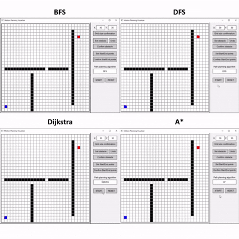

# Path Finding Visualization

This project implements various path finding algorithms with visualization capabilities to study and compare their performance in motion planning scenarios.

## 1. Project Motivation

The ability to find optimal paths in complex environments is crucial for robotics and autonomous systems. This project aims to:
- Provide a visual understanding of how different path finding algorithms work
- Compare the performance and characteristics of various algorithms
- Create an interactive platform for testing algorithms with different obstacle configurations
- Serve as an educational tool for understanding motion planning concepts

## 2. Implemented Path Finding Algorithms

The following algorithms have been implemented:

### 2.1 Graph-Based Search Algorithms
- **Breadth-First Search (BFS)**: Uniform expansion path finding
- **Depth-First Search (DFS)**: Deep exploration path finding
- **Dijkstra's Algorithm**: Shortest path finding with uniform cost
- **A* (A-Star)**: Optimal path finding using heuristic search

### 2.2 Sampling-Based Algorithms
- **RRT (Rapidly-exploring Random Tree)**: TBU

## 3. Visualization Results



*Interactive visualization showing pathfinding algorithms in action with obstacle avoidance*

## 4. Architectural Design

The project follows a modular architecture with clear separation of concerns:

### 4.1 Core Components

```
motionplanning/
├── mpalgo/                              # Algorithm implementations
│   ├── searching_based_planning/        # Graph-based search algorithms
│   │   ├── astar/                       # A* algorithm
│   │   ├── bfs/                         # Breadth-First Search
│   │   ├── dfs/                         # Depth-First Search
│   │   ├── dijkstra/                    # Dijkstra's algorithm
│   │   ├── include/
│   │   │   └── pathfinding_main.hpp     # Base class for all pathfinding algorithms
│   │   └── src/
│   │       └── pathfinding_main.cpp     # Base class implementation
│   └── sampling_based_planning/         # Sampling-based algorithms (future)
│       └── rrt/                         # RRT algorithm (TBU)
├── visualization/                       # Visualization components
│   └── searching_based_visualization/   # Visualization for search algorithms
│       ├── include/
│       │   ├── grid.hpp                # Grid environment representation
│       │   ├── obstacle.hpp            # Obstacle management system
│       │   └── visualization.hpp       # Main visualization interface
│       └── src/
│           ├── grid.cpp                # Grid implementation
│           ├── obstacle.cpp            # Obstacle implementation
│           └── visualization.cpp       # Visualization implementation with SFML
└── main.cpp                            # Application entry point
```

**Component Descriptions:**

- **mpalgo/**: Contains all pathfinding algorithm implementations
  - **searching_based_planning/**: Graph-based search algorithms with base class architecture
    - Each algorithm (A*, BFS, DFS, Dijkstra) inherits from `PathFindingAlgorithm` base class
    - Common functionality (path validation, neighbor search) shared through inheritance
  - **sampling_based_planning/**: Future expansion for sampling-based methods

- **visualization/**: Interactive SFML-based visualization system
  - **Grid**: Manages 2D grid environment with cell states (empty, obstacle, start, goal, path, visited)
  - **Obstacle**: Handles obstacle placement and removal with undo functionality
  - **Visualizer**: Main interface with user controls, algorithm selection, and path animation

### 4.2 Key Features
- Modular algorithm implementation
- SFML-based visualization
- Grid-based environment representation
- Interactive user interface
- Extensible architecture for adding new algorithms

## 5. Setup and Running Instructions

### Prerequisites
- C++ compiler with C++17 support
- CMake (version 3.1 or higher)
- SFML library
- MinGW (for Windows)

### Building the Project

1. Clone the repository:
```bash
git clone https://github.com/orkard1609/mpc.git
cd mpc
```

2. Create build directory:
```bash
cd motionplanning
mkdir build
cd build
```

3. Configure with CMake:
```bash
cmake ..
```

4. Build the project:
```bash
make
```

### Running the Application

1. From the build directory:
```bash
./MotionPlanning
```

2. Using the Interface:
   - Click "Set obstacle" to place obstacles
   - Use "Set Start/End points" to define start and goal positions
   - Select a path finding algorithm from the dropdown
   - Click "START" to run the visualization
   - Use "RESET" to clear the grid

### Notes
- Grid size can be adjusted using the input boxes (5-100 cells)
- Visualization speed is set to show progression of the algorithm
- Each algorithm can be selected and compared in the same environment